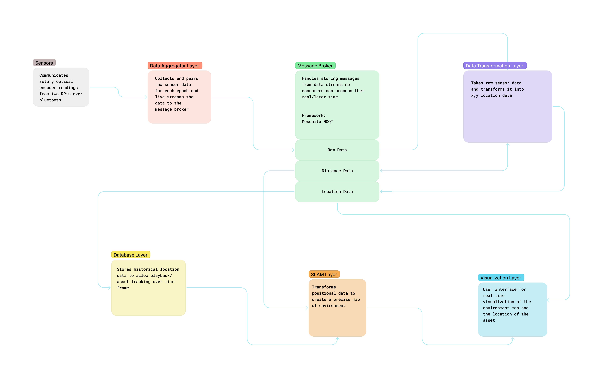

# Source Code Folder
**To run application, update config.json with your unique configuration parameters and then run initialize.py**  

------
  
 

| Subdirectory Name | Description |
|---|---|
|app| Main python package, all other directories are sub-packages of the app package.|
|Aggregator | Handles configuring and initializing platform independent senors.|
|Database |Handles how to store historical and current location data. |
|lib |Helper classes|
|Transformation |Responsible for transforming raw sensor data into x,y coordinates for an asset |
|Visualization | Front end for visualizing asset location.|
| GPS | Reading in GPS lat, lon coordinates via GPS2IP app, plotting using gmplot onto Google Maps | 
| Sensor Drift Test Logs | Collection of test logs created during Spring semester | 
| analyze_drift.ipynb | Jupyter Notebook file used to generate Allan Deviation plots from .log files |

------
 

## High Level Architecture

  
[Figma link to High Level Architecture](https://www.figma.com/file/QpHLV2bYdOp85XvTa2iev8/Capstone-High-Level-Architecture?node-id=0%3A1&t=K7Jq5j7D3IPaZaWu-1)

